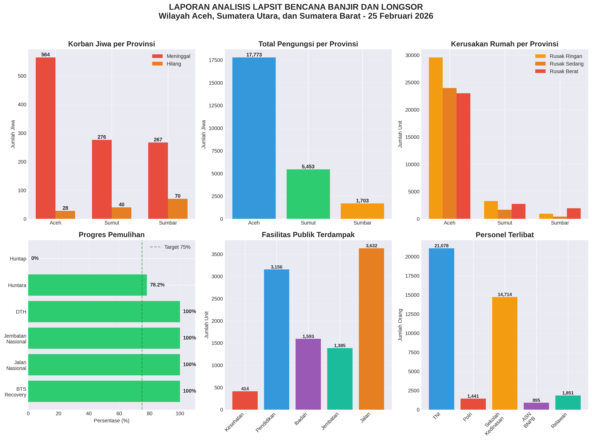
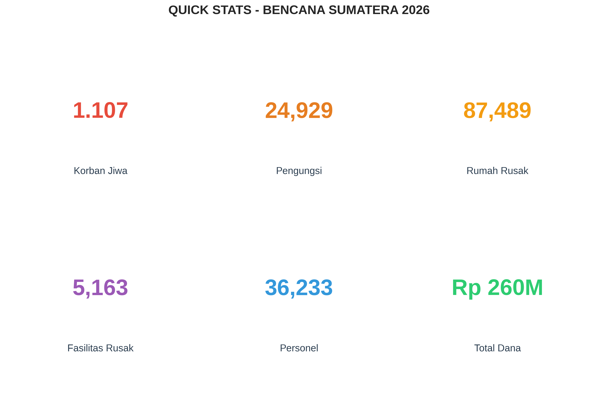

# Analisis LAPSIT Harian Bencana Banjir dan Longsor Sumatera 2026

Repository ini berisi analisis komprehensif dari data situasi harian (LAPSIT) bencana banjir dan longsor yang melanda Provinsi Aceh, Sumatera Utara, dan Sumatera Barat.

## 📊 File dalam Repository

### 1. Laporan Analisis
- **`lapsit-analysis.md`** - Laporan lengkap dalam format Markdown
  - Dampak kemanusiaan
  - Kerusakan infrastruktur
  - Progres pemulihan
  - Analisis dan rekomendasi

### 2. Visualisasi Data
- **`lapsit_visualization.png`** - Grafik komprehensif 6 panel:
  - Korban jiwa per provinsi
  - Total pengungsi
  - Kerusakan rumah
  - Progres pemulihan
  - Fasilitas terdampak
  - Personel terlibat

- **`lapsit_quickstats.png`** - Infografis ringkasan statistik

### 3. Data mentah
- **`lapsit_data.csv`** - Data terstruktur dalam format CSV
  - Siap untuk diimport ke Excel/Google Sheets
  - Data per kategori dan provinsi

---

## 📈 Quick Stats

| Metrik | Nilai |
|--------|-------|
| **Total Korban Jiwa** | 1.107 |
| **Total Pengungsi** | 24.929 |
| **Total Rumah Rusak** | 87.489 |
| **Total Fasilitas Rusak** | 5.163 |
| **Total Personel** | 36.233 |
| **Total Dana DTH** | Rp 19,3 Miliar |
| **Total Dana Bantuan Rumah** | Rp 240,6 Miliar |

---

## ✅ Pencapaian Pemulihan

| Indikator | Persentase |
|-----------|-----------|
| BTS Recovery | 100% ✅ |
| Jalan Nasional Fungsional | 100% ✅ |
| Jembatan Nasional Fungsional | 100% ✅ |
| Penyaluran DTH | 100% ✅ |
| Huntara Selesai | 78.2% |
| Huntap Selesai | 0% |

---

## 📋 Sumber Data

- **BNPB** (Badan Nasional Penanggulangan Bencana)
- **Kementerian PUPR**
- **TNI AD**
- **Polri**
- **Kementerian Dalam Negeri**
- **Kementerian Komunikasi dan Digital**

**Tanggal Data:** 25 Februari 2026, Pukul 15.00 WIB

---

## 🔍 Temuan Utama

### Pencapaian Positif ✅
1. Semua BTS (11.143 unit) sudah recovery
2. 100% jalan nasional fungsional
3. Dana tunggu hunian 100% tersalurkan ke 10.748 KK
4. 78.2% hunian sementara selesai

### Tantangan ⚠️
1. Hunian tetap masih 0%
2. Jembatan daerah baru 67.1% fungsional
3. 40% fasilitas pendidikan belum beroperasi
4. 23.5% lokasi pembersihan lumpur di Aceh masih on going

---

## 📊 Visualisasi

### Grafik Komprehensif

### Quick Stats

---

## 🎯 Rekomendasi

### Prioritas Tinggi
1. **Percepatan Pembangunan Huntap** - Target 6 bulan
2. **Perbaikan Jembatan Daerah** - Fokus Aceh & Sumbar
3. **Pemulihan Fasilitas Pendidikan** - Target 100% dalam 3 bulan

### Prioritas Sedang
4. **Percepatan Pembersihan Lumpur** - Target 1 bulan
5. **Normalisasi Sungai** - Pencegahan banjir susulan

---

## 📁 Cara Menggunakan Data

### Import ke Excel
1. Download `lapsit_data.csv`
2. Buka Excel
3. Data > From Text/CSV
4. Pilih file CSV
5. Import

### Import ke Google Sheets
1. Buka Google Sheets
2. File > Import
3. Upload `lapsit_data.csv`
4. Import

---

## 📞 Kontak

**Repository:** bungker212  
**GitHub:** https://github.com/bungker212  
**Analisis oleh:** Bungker AI Assistant  
**Tanggal Analisis:** 26 Februari 2026

---

## ⚠️ Disclaimer

Data ini bersumber dari LAPSIT Harian dan dapat berubah sewaktu-waktu. Untuk data terkini, silakan menghubungi BNPB atau BPBD setempat.

---

**Last Updated:** 26 Februari 2026
