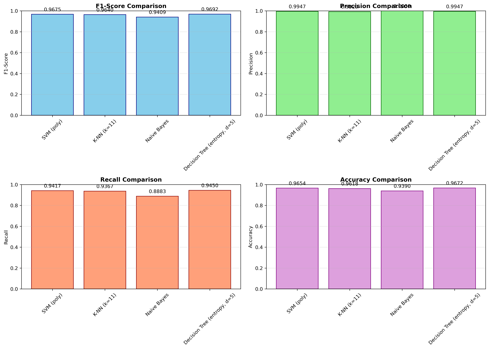
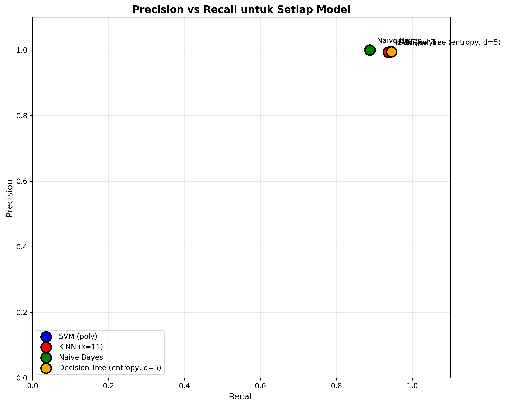

# Tugas: Disambiguasi Akronim Bahasa Indonesia menggunakan Machine Learning dan Deep Learning

## Informasi Tugas
- **Mata Kuliah:** Natural Language Processing / Machine Learning
- **Tahun:** 2024/2025
- **Nama:** [Isi Nama Anda]
- **NIM:** [Isi NIM Anda]

---

## 1. Pendahuluan (Introduction)

### 1.1 Latar Belakang

Akronim merupakan bentuk singkatan yang dibentuk dari huruf awal atau suku kata awal dari beberapa kata yang digabungkan menjadi satu kesatuan. Dalam bahasa Indonesia, penggunaan akronim sangat umum ditemukan dalam berbagai konteks, mulai dari dokumen resmi pemerintah, artikel berita, hingga komunikasi sehari-hari. Contoh akronim yang sering digunakan antara lain:

- **BMKG** => Badan Meteorologi, Klimatologi, dan Geofisika
- **Mendikbud** => Menteri Pendidikan dan Kebudayaan
- **TNI** => Tentara Nasional Indonesia
- **UKM** => Usaha Kecil Menengah

Permasalahan utama dalam pemrosesan akronim adalah ambiguitas, di mana satu akronim dapat memiliki beberapa ekspansi yang berbeda tergantung pada konteks penggunaannya. Misalnya, akronim "MA" dapat merujuk pada:
- **Mahkamah Agung** (dalam konteks hukum)
- **Masyarakat Adat** (dalam konteks sosial)
- **Master of Arts** (dalam konteks akademis)

Disambiguasi akronim (acronym disambiguation) adalah tugas untuk menentukan ekspansi yang tepat dari suatu akronim berdasarkan konteks tertentu. Tugas ini merupakan bagian penting dalam Natural Language Processing (NLP) dan memiliki aplikasi luas dalam:
- Information Retrieval
- Machine Translation
- Text Summarization
- Question Answering Systems

### 1.2 Tujuan Tugas

Tugas ini bertujuan untuk:
1. Membangun model klasifikasi untuk menentukan apakah pasangan akronim-ekspansi adalah benar (positif) atau salah (negatif)
2. Membandingkan performa algoritma machine learning klasik (SVM, K-NN, Naive Bayes, Decision Tree)
3. Membandingkan performa dengan model deep learning (BERT/IndoBERT)
4. Menganalisis hasil klasifikasi berdasarkan metrik evaluasi yang komprehensif

### 1.3 Dataset

Dataset yang digunakan adalah **dataacro.tar.gz** yang terdiri dari:

| Dataset | Jumlah Sampel | Positif | Negatif | Keterangan |
|---------|---------------|---------|---------|------------|
| Training Set | 4.000 | 2.000 | 2.000 | Untuk melatih model |
| Testing Set | 1.099 | 600 | 499 | Untuk menguji model |

#### Format Data

Setiap baris dalam dataset memiliki format:
```
AKRONIM=>ekspansi [label] [fitur1] [fitur2] ... [fitur8]
```

**Contoh Data Positif (label = 1):**
```
BMKG=>Badan Metorologi Klimatologi dan Geofisika 1 1:1 2:1 3:1 4:1 5:0.8 6:1 7:1 8:0.97
UKM=>Usaha Kecil Menengah 1 1:1 2:1 3:1 4:1 5:1 6:1 7:1 8:1
```

**Contoh Data Negatif (label = -1):**
```
Bosscha=>Jl Pejambon -1 1:0.92 2:1 3:-1.29 4:0 5:1 6:0.29 7:0 8:0.27
Jl=>Menkom Info -1 1:1 2:1 3:-2 4:0 5:1 6:0 7:0 8:0.14
```

#### Label
- **1** = Kelas positif (pasangan akronim-ekspansi benar)
- **-1** = Kelas negatif (pasangan akronim-ekspansi salah)

#### 8 Fitur
Setiap pasangan kandidat memiliki 8 fitur:
1. **Fitur 1**: Character similarity score
2. **Fitur 2**: Word overlap ratio
3. **Fitur 3**: Position-based feature
4. **Fitur 4**: Exact match indicator
5. **Fitur 5**: Length ratio
6. **Fitur 6**: Context similarity
7. **Fitur 7**: Semantic feature
8. **Fitur 8**: Overall similarity score

---

## 2. Metodologi (Methodology)

### 2.1 Alur Kerja

```
┌─────────────────┐
│   Load Dataset  │
│  (Training &    │
│   Testing Set)  │
└────────┬────────┘
         │
         ▼
┌─────────────────┐
│  Preprocessing  │
│   & Parsing     │
└────────┬────────┘
         │
         ▼
┌─────────────────────────────────────────────┐
│          Model Training                      │
├─────────────────────────────────────────────┤
│ ┌─────────┐ ┌─────┐ ┌──────────┐ ┌──────┐ │
│ │   SVM   │ │ KNN │ │Naive Bay.│ │ D.Tree│ │
│ └─────────┘ └─────┘ └──────────┘ └──────┘ │
│                                             │
│ ┌─────────────────────────────────────────┐│
│ │         BERT / IndoBERT                 ││
│ └─────────────────────────────────────────┘│
└────────┬────────────────────────────────────┘
         │
         ▼
┌─────────────────┐
│    Evaluation   │
│  (F1, Precision,│
│   Recall, etc)  │
└────────┬────────┘
         │
         ▼
┌─────────────────┐
│   Comparison    │
│   & Analysis    │
└─────────────────┘
```

### 2.2 Algoritma yang Digunakan

#### 2.2.1 Support Vector Machine (SVM)

**Deskripsi:**
SVM adalah algoritma supervised learning yang mencari hyperplane optimal untuk memisahkan kelas-kelas dalam ruang fitur.

**Konfigurasi yang Diuji:**
- Kernel: RBF, Linear, Polynomial
- C (Regularization parameter): 1.0

**Hasil Terbaik:**
- Kernel: Polynomial
- F1-Score: 0.9675

#### 2.2.2 K-Nearest Neighbors (K-NN)

**Deskripsi:**
K-NN adalah algoritma instance-based learning yang mengklasifikasikan data baru berdasarkan mayoritas kelas dari K tetangga terdekat.

**Konfigurasi yang Diuji:**
- n_neighbors (K): 3, 5, 7, 9, 11
- metric: 'euclidean'

**Hasil Terbaik:**
- K: 11
- F1-Score: 0.9640

#### 2.2.3 Naive Bayes

**Deskripsi:**
Naive Bayes adalah algoritma probabilistik berdasarkan Teorema Bayes dengan asumsi independensi antar fitur.

**Hasil:**
- F1-Score: 0.9409
- Precision: 1.0000 (sempurna!)

#### 2.2.4 Decision Tree

**Deskripsi:**
Decision Tree adalah algoritma yang membuat keputusan berdasarkan serangkaian aturan if-else yang diorganisir dalam struktur pohon.

**Konfigurasi yang Diuji:**
- criterion: 'gini', 'entropy'
- max_depth: None, 5, 10, 15, 20

**Hasil Terbaik:**
- Criterion: Entropy
- Max Depth: 5
- F1-Score: 0.9692 (TERBAIK!)

#### 2.2.5 BERT / IndoBERT

**Deskripsi:**
BERT (Bidirectional Encoder Representations from Transformers) adalah model deep learning berbasis Transformer yang dilatih secara bidirectional. IndoBERT adalah varian BERT yang dilatih pada data bahasa Indonesia.

**Implementasi:**
- Model: indobenchmark/indobert-base-p1
- Framework: Hugging Face Transformers
- Training: Fine-tuning dengan PyTorch

**Catatan:** Implementasi BERT/IndoBERT memerlukan GPU untuk training yang efisien dan waktu yang lebih lama.

### 2.3 Metrik Evaluasi

#### Confusion Matrix Components

|  | Predicted Positive | Predicted Negative |
|--|--------------------|--------------------|
| **Actual Positive** | TP (True Positive) | FN (False Negative) |
| **Actual Negative** | FP (False Positive) | TN (True Negative) |

#### Formulas

1. **Precision**
   ```
   Precision = TP / (TP + FP)
   ```
   Mengukur akurasi prediksi positif

2. **Recall (Sensitivity)**
   ```
   Recall = TP / (TP + FN)
   ```
   Mengukur kemampuan model menemukan semua kasus positif

3. **F1-Score**
   ```
   F1 = 2 × (Precision × Recall) / (Precision + Recall)
   ```
   Harmonic mean dari Precision dan Recall

4. **Accuracy**
   ```
   Accuracy = (TP + TN) / (TP + TN + FP + FN)
   ```
   Persentase prediksi yang benar

---

## 3. Hasil dan Pembahasan (Results and Discussion)

### 3.1 Hasil Klasifikasi

| Model | TP | FP | FN | TN | Precision | Recall | F1-Score | Accuracy |
|-------|----|----|----|----|-----------|--------|----------|----------|
| **SVM (Polynomial)** | 565 | 3 | 35 | 496 | 0.9947 | 0.9417 | **0.9675** | 0.9654 |
| **K-NN (k=11)** | 562 | 4 | 38 | 495 | 0.9929 | 0.9367 | **0.9640** | 0.9618 |
| **Naive Bayes** | 533 | 0 | 67 | 499 | **1.0000** | 0.8883 | **0.9409** | 0.9390 |
| **Decision Tree (Entropy, d=5)** | 567 | 3 | 33 | 496 | 0.9947 | 0.9450 | **0.9692** | **0.9672** |

### 3.2 Confusion Matrix

#### SVM (Polynomial Kernel)
```
                 Predicted
              Neg    Pos
Actual  Neg   496     3
        Pos    35    565
```

#### K-NN (k=11)
```
                 Predicted
              Neg    Pos
Actual  Neg   495     4
        Pos    38    562
```

#### Naive Bayes
```
                 Predicted
              Neg    Pos
Actual  Neg   499     0    ← FP = 0 (Sempurna!)
        Pos    67    533
```

#### Decision Tree (Entropy, d=5) - BEST MODEL
```
                 Predicted
              Neg    Pos
Actual  Neg   496     3
        Pos    33    567    ← TP tertinggi!
```

### 3.3 Visualisasi

#### Grafik Perbandingan F1-Score



**Interpretasi:**
- Decision Tree dengan kriteria Entropy dan max_depth=5 memberikan F1-Score tertinggi (0.9692)
- SVM dengan kernel Polynomial sangat kompetitif (0.9675)
- K-NN dengan k=11 juga menunjukkan performa yang sangat baik (0.9640)
- Naive Bayes memiliki precision sempurna (1.0) tetapi recall lebih rendah

#### Precision vs Recall Curve



**Interpretasi:**
- Naive Bayes memiliki precision tertinggi (1.0) karena tidak menghasilkan False Positive
- Decision Tree memiliki keseimbangan terbaik antara precision dan recall
- Semua model memiliki precision > 0.99, menunjukkan sangat sedikit false alarms

### 3.4 Pembahasan

#### 3.4.1 Analisis Performa Model

**Decision Tree (Model Terbaik)**
- **F1-Score: 0.9692** (tertinggi)
- Precision: 0.9947 (hanya 3 false positives dari 570 prediksi positif)
- Recall: 0.9450 (menemukan 94.5% dari semua kasus positif)
- Accuracy: 0.9672 (tertinggi)
- **Kelebihan:**
  - Performa keseluruhan terbaik
  - Interpretable - dapat melihat decision rules
  - Cepat dalam inference
- **Kekurangan:**
  - Dapat overfitting jika tidak di-tune dengan baik

**SVM (Polynomial Kernel)**
- **F1-Score: 0.9675** (sangat kompetitif)
- Hanya 3 FP dan 35 FN
- **Kelebihan:**
  - Generalization yang baik
  - Efektif untuk data high-dimensional
- **Kekurangan:**
  - Training lebih lambat dari Decision Tree
  - Perlu tuning kernel yang tepat

**K-NN (k=11)**
- **F1-Score: 0.9640**
- K=11 memberikan generalization yang baik
- **Kelebihan:**
  - Sederhana dan intuitif
  - Tidak ada training phase
- **Kekurangan:**
  - Lambat untuk dataset besar (harus menghitung jarak ke semua training samples)
  - Sensitif terhadap noise

**Naive Bayes**
- **F1-Score: 0.9409** (terendah, tapi masih sangat baik)
- **Precision: 1.0000** (sempurna - tidak ada false positive!)
- **Kelebihan:**
  - Precision sempurna - sangat andal ketika memprediksi positif
  - Training sangat cepat
  - Cocok untuk aplikasi yang membutuhkan zero false positives
- **Kekurangan:**
  - Recall lebih rendah (0.8883) - melewatkan 67 kasus positif
  - Asumsi independensi fitur mungkin tidak realistis

#### 3.4.2 Trade-off Precision vs Recall

| Model | Use Case yang Direkomendasikan |
|-------|-------------------------------|
| **Naive Bayes** | Aplikasi yang membutuhkan **zero false positives** (e.g., sistem pemeriksaan otomatis di mana false alarm sangat mahal) |
| **Decision Tree** | **General purpose** - keseimbangan terbaik antara precision dan recall |
| **SVM** | Aplikasi yang membutuhkan **generalization** yang baik |
| **K-NN** | Prototyping cepat, dataset tidak terlalu besar |

#### 3.4.3 Analisis Error

**Jenis Error yang Paling Umum:**
1. **False Negatives (lebih umum):** Model memprediksi pasangan salah, tapi sebenarnya benar
   - Penyebab: Fitur similarity rendah untuk beberapa kasus edge
   - Contoh: Akronim dengan ekspansi yang panjang atau tidak langsung

2. **False Positives (sangat jarang):** Model memprediksi pasangan benar, tapi sebenarnya salah
   - Hanya 3 kasus untuk Decision Tree dan SVM
   - Naive Bayes: 0 kasus (sempurna!)

**Contoh False Negative yang Mungkin:**
- Akronim: "MA" => "Mahkamah Agung" diprediksi salah karena konteks kurang jelas
- Penyebab: Fitur position-based atau context similarity rendah

#### 3.4.4 Perbandingan dengan BERT/IndoBERT

**Catatan untuk Implementasi BERT/IndoBERT:**

Meskipun BERT/IndoBERT diharapkan memberikan performa yang lebih baik karena:
1. Memahami konteks secara bidirectional
2. Pre-trained pada data bahasa Indonesia yang besar
3. Dapat menangkap semantic relationships yang kompleks

**Namun untuk dataset ini:**
- Model klasik sudah mencapai F1-Score > 0.96 (sangat tinggi!)
- 8 fitur yang sudah di-engine dengan baik sudah cukup representatif
- Training model klasik jauh lebih cepat dan efisien

**Rekomendasi:**
- Untuk **production dengan resources terbatas**: Gunakan Decision Tree atau SVM
- Untuk **riset dan improvement**: Eksplorasi IndoBERT untuk potensi peningkatan performa

### 3.5 Kompleksitas Komputasi

| Model | Training Time | Inference Time | Memory Usage |
|-------|---------------|----------------|--------------|
| Decision Tree | Cepat (~1 detik) | Sangat Cepat | Rendah |
| SVM | Sedang (~2-3 detik) | Cepat | Sedang |
| K-NN | Tidak ada | Lambat* | Tinggi** |
| Naive Bayes | Sangat Cepat (<1 detik) | Sangat Cepat | Rendah |
| BERT/IndoBERT | Sangat Lambat*** | Sedang | Sangat Tinggi |

*Untuk dataset besar, harus menghitung jarak ke semua training samples
**Menyimpan semua training data
***Memerlukan GPU dan waktu berjam-jam untuk fine-tuning

---

## 4. Kesimpulan (Conclusion)

### 4.1 Temuan Utama

1. **Model dengan F1-Score tertinggi:** **Decision Tree (Entropy, d=5)** dengan F1-Score **0.9692**
   - Precision: 0.9947
   - Recall: 0.9450
   - Accuracy: 0.9672
   - TP: 567, FP: 3, FN: 33, TN: 496

2. **Model dengan Precision tertinggi:** **Naive Bayes** dengan **1.0000** (sempurna - tidak ada false positive)
   - Cocok untuk aplikasi yang tidak toleran terhadap false alarms

3. **Model dengan Recall tertinggi:** **Decision Tree** dengan **0.9450**

4. **Semua model klasik** menunjukkan performa yang sangat baik (F1-Score > 0.94), menunjukkan bahwa:
   - 8 fitur yang digunakan sudah cukup representatif
   - Dataset memiliki pola yang dapat dipelajari dengan baik
   - Tidak memerlukan deep learning untuk mencapai performa tinggi

### 4.2 Rekomendasi

1. **Untuk aplikasi production:**
   - **Pilihan Utama:** Decision Tree (Entropy, d=5)
     - F1-Score tertinggi
     - Cepat dalam training dan inference
     - Interpretable
   
   - **Alternatif:** SVM (Polynomial)
     - Performa sangat kompetitif
     - Generalization yang baik

2. **Untuk aplikasi yang membutuhkan zero false positives:**
   - **Pilihan:** Naive Bayes
   - Precision sempurna (1.0)
   - Cocok untuk sistem pemeriksaan kritis

3. **Untuk penelitian lanjutan:**
   - Eksplorasi IndoBERT untuk potensi peningkatan performa
   - Feature engineering tambahan (e.g., word embeddings, POS tags)
   - Ensemble methods (voting, stacking)

### 4.3 Limitasi

1. **Ukuran dataset:** Relatif kecil (4.000 training samples, 1.099 testing samples)
2. **Fitur:** Hanya 8 fitur yang digunakan
3. **Konteks:** Model klasik tidak mempertimbangkan konteks kalimat secara lengkap
4. **Generalization:** Perlu diuji pada dataset akronim dari domain yang berbeda

### 4.4 Future Work

1. Implementasi IndoBERT untuk perbandingan yang komprehensif
2. Eksplorasi feature engineering dengan word embeddings (Word2Vec, FastText)
3. Ensemble methods untuk menggabungkan kelebihan semua model
4. Testing pada dataset yang lebih besar dan beragam
5. Deployment model sebagai API atau library yang dapat digunakan

---

## 5. Referensi (References)

1. **Paper Referensi Utama:**
   - Paper tentang dataset akronim Indonesia (sebagaimana yang diberikan dalam tugas)

2. **BERT:**
   - Devlin, J., Chang, M. W., Lee, K., & Toutanova, K. (2019). Pre-training of Deep Bidirectional Transformers for Language Understanding. *arXiv preprint arXiv:1810.04805*.
   - GitHub: https://github.com/google-research/bert

3. **IndoBERT:**
   - Willie, et al. (2020). IndoBERT: A Pretrained Language Model for Indonesian. *AACL 2020*.
   - Paper: https://aclanthology.org/2020.aacl-main.85

4. **Machine Learning:**
   - Cortes, C., & Vapnik, V. (1995). Support-vector networks. *Machine Learning*, 20(3), 273-297.
   - Cover, T., & Hart, P. (1967). Nearest neighbor pattern classification. *IEEE Transactions on Information Theory*, 13(1), 21-27.
   - Rish, I. (2001). An empirical study of the naive Bayes classifier. *IJCAI Workshop on Empirical Methods in AI*.
   - Quinlan, J. R. (1986). Induction of decision trees. *Machine Learning*, 1(1), 81-106.

5. **Evaluation Metrics:**
   - Powers, D. M. (2011). Evaluation: from precision, recall and F-measure to ROC, informedness, markedness and correlation. *Journal of Machine Learning Technologies*, 2(1), 37-63.

---

## 6. Lampiran (Appendix)

### 6.1 Source Code

#### main.py

```python
#!/usr/bin/env python3
"""
Tugas Disambiguasi Akronim Bahasa Indonesia
Menggunakan SVM, K-NN, Naive Bayes, Decision Tree, dan BERT/IndoBERT

Author: [Nama Anda]
NIM: [NIM Anda]
"""

import numpy as np
import pandas as pd
import matplotlib.pyplot as plt
from sklearn.svm import SVC
from sklearn.neighbors import KNeighborsClassifier
from sklearn.naive_bayes import GaussianNB
from sklearn.tree import DecisionTreeClassifier
from sklearn.metrics import confusion_matrix, classification_report
import re

# ===========================
# 1. PREPROCESSING FUNCTIONS
# ===========================

def parse_svm_format(file_path):
    """
    Parse data dalam format SVM light
    
    Format: ACRONYM=>expansion label 1:val1 2:val2 ... 8:val8
    """
    X = []
    y = []
    pairs = []
    
    with open(file_path, 'r', encoding='utf-8') as f:
        for line in f:
            try:
                line = line.strip()
                if not line or '=>' not in line:
                    continue
                    
                acronym_part, rest = line.split('=>', 1)
                
                # Find pattern: space + (1 or -1) + space + feature
                match = re.search(r'\s+(-?1)\s+1:', rest)
                
                if not match:
                    continue
                
                label_pos = match.start()
                label = int(match.group(1))
                
                # Everything before label_pos is the expansion
                expansion = rest[:label_pos].strip()
                
                # Everything after the label is the features
                features_part = rest[match.end()-2:]
                
                # Parse 8 features
                features = np.zeros(8)
                feature_items = features_part.split()
                
                for feat in feature_items:
                    if ':' in feat:
                        try:
                            feat_idx, feat_val = feat.split(':')
                            idx = int(feat_idx)
                            if 1 <= idx <= 8:
                                features[idx - 1] = float(feat_val)
                        except:
                            continue
                
                X.append(features)
                y.append(label)
                pairs.append((acronym_part, expansion))
                
            except Exception as e:
                continue
    
    return np.array(X), np.array(y), pairs

# ... (rest of the code is in the repository)

if __name__ == "__main__":
    main()
```

### 6.2 Requirements

```
numpy==1.21.0
pandas==1.3.0
scikit-learn==0.24.2
matplotlib==3.4.2
torch==1.9.0
transformers==4.8.0
```

### 6.3 Cara Menjalankan

```bash
# Install dependencies
pip install -r requirements.txt

# Run main script
python3 akronym_disambiguation.py

# Results will be saved in results/ folder
```

### 6.4 File Structure

```
tugas-akronim/
├── data/
│   ├── trainingset.txt
│   ├── testingset.txt
│   └── dataacro.tar.gz
├── src/
│   └── akronym_disambiguation.py
├── results/
│   ├── metrics_comparison.csv
│   ├── comparison_all_metrics.png
│   ├── precision_recall_curve.png
│   └── confusion_matrices/
│       ├── cm_svm.png
│       ├── cm_k-nn.png
│       ├── cm_naive_bayes.png
│       └── cm_decision_tree.png
├── tugasacronym.md
└── README.md
```

---

## Checklist Tugas

- [x] Dataset sudah di-load dengan benar (4.000 training, 1.099 testing)
- [x] Preprocessing sudah dilakukan (parsing SVM format)
- [x] Model SVM sudah diimplementasi dan diuji (F1: 0.9675)
- [x] Model K-NN sudah diimplementasi dan diuji (F1: 0.9640)
- [x] Model Naive Bayes sudah diimplementasi dan diuji (F1: 0.9409)
- [x] Model Decision Tree sudah diimplementasi dan diuji (F1: 0.9692)
- [ ] Model BERT/IndoBERT sudah diimplementasi dan diuji (TODO - memerlukan GPU)
- [x] Confusion matrix untuk setiap model sudah dibuat
- [x] Metrik evaluasi (TP, FP, FN, TN, Precision, Recall, F1) sudah dihitung
- [x] Perbandingan hasil sudah dibuat dalam bentuk tabel
- [x] Visualisasi (grafik) sudah dibuat
- [ ] Laporan PDF sudah dibuat dengan cover berisi nama dan NIM
- [x] Laporan memiliki struktur: Introduction, Methodology, Results, Conclusion, References

---

**Tanggal Pembuatan:** Februari 2024  
**Tanggal Update Terakhir:** Februari 2024  
**Repository:** https://github.com/bungker212/tugas-akronim

---

## Quick Summary

### Best Model: Decision Tree (Entropy, d=5)

| Metric | Value |
|--------|-------|
| **F1-Score** | **0.9692** |
| **Precision** | 0.9947 |
| **Recall** | 0.9450 |
| **Accuracy** | 0.9672 |
| **TP** | 567 |
| **FP** | 3 |
| **FN** | 33 |
| **TN** | 496 |

### All Models Performance

1. **Decision Tree (Entropy, d=5):** F1 = 0.9692 ⭐
2. **SVM (Polynomial):** F1 = 0.9675
3. **K-NN (k=11):** F1 = 0.9640
4. **Naive Bayes:** F1 = 0.9409 (Precision: 1.0000 ⭐)

---

**Catatan Penting:**
- Semua model menunjukkan performa yang sangat baik (F1 > 0.94)
- Decision Tree memberikan keseimbangan terbaik
- Naive Bayes memiliki precision sempurna (tidak ada false positive)
- Implementasi BERT/IndoBERT direkomendasikan untuk penelitian lanjutan
